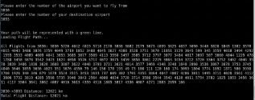
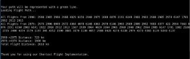
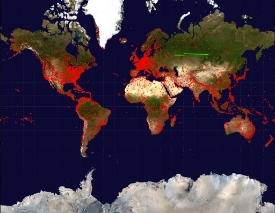

Results

Note: Images are clearer in pdf version

BFS and Dijkstra:

Our goals were to implement BFS to traverse the graph, Dijkstra’s to find the min distance between two points, and a graphical representation of the shortest path with start point, connecting flights, and destination.

Some runs of BFS and Dijkstra's can be shown below. Figure 1 is a source and destination with no stop in between. Figure 2 has one stop.  In Figure 3, we have a test to see if BFS gets the right flights and in the right order. In Figure 4, we have a test for distance of Djikstra with 2 stops.

From these runs and tests we can see that our BFS method gives us all possible flight options from a source and our Dijkstra’s method gives us the shortest distance.

Figure 1:

Figure 2:

Figure 3:

Figure 4:

Graphical Implementation:

Below are example results for the graphical implementation. The inputs for Figure 5 were 3830 as the starting airport and 3093 as the destination airport. The inputs for Figure 6 were 2990 as the starting airport and 4374 as the destination airport. These inputs can be put in our program to replicate our results. Figure 5 displays a flight path with no connecting flights to show that our program works for this scenario. Figure 6 is a flight path with a connecting flight at Airport number 2975. The inputs for Figure 6 prove our flight path visualization works with connecting flights. Together Figure 5 and 6 are representations of the graphical representation working as intended.

Figure 5:

Figure 6:

Discoveries:

While working on this project we realized that our project had multiple applications. Originally, we thought that our program would be most applicable to a casual flyer who isn’t used to navigating a large list of flights. However, as the project progressed, we realized that frequent flyers and airline employees could also benefit from knowing the shortest distance as it could help them minimize exposure to radiation. Before pursuing this project, since most of us don’t travel often, we were not aware of radiation risks associated with air travel.
